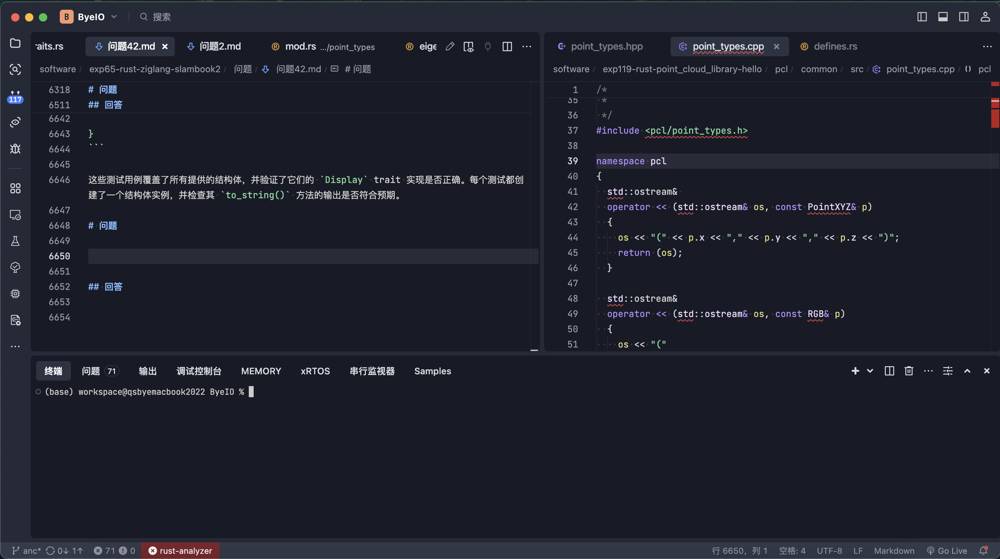
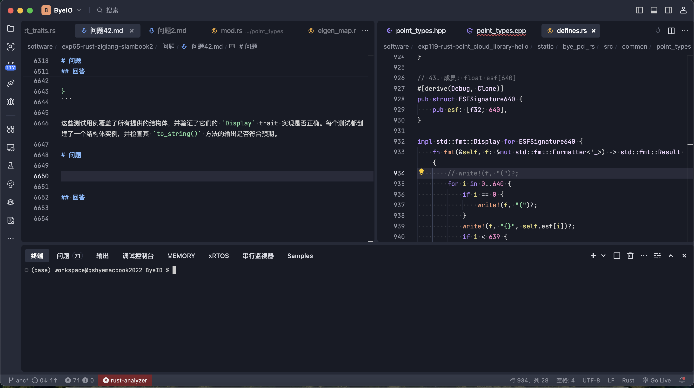

# 移植Trae编辑器默认主题到Zed编辑器/A theme for Zed Editor based on the Trae Editor Default Theme
- 启发自vscode extension:yanfeixin.trae-themes
- Project inspired on `vscode extension : yanfeixin.trae-themes`.
- 使用AI进行格式转换.

## 更新日志/Changelog
1. v0.0.1:大概对照颜色改了一下,效果可能还有问题

## 安装/Installation

1. Open `Command Palette`
2. Select `zed: extensions`
3. Search `Trae Theme`

## 激活主题/Activate Theme

1. Open `Command Palette`
2. Select `theme selector: toggle`
3. Search `Trae Dark Blue` or `Trae Dark Modern`

## 设置字体(可选)/Setting Fonts(Optional)

- 字体文件在fonts文件夹[JetBrainsMono](./fonts/JetBrainsMono/fonts/ttf/JetBrainsMono-Regular.ttf)
```json
// 设置字体
"buffer_font_family": "JetBrains Mono NL",
"ui_font_family": "JetBrains Mono NL"
```

## 效果图/Screenshots



## Contributing

Feel free to fork, make changes, and submit a pull request.

## Publishing new versions
1. Update the version in `extension.toml`
2. Commit and push your changes (make sure to push the built files in `themes/` as well)
3. Follow the [Zed publishing docs](https://zed.dev/docs/extensions/developing-extensions#updating-an-extension) to publish the extension
